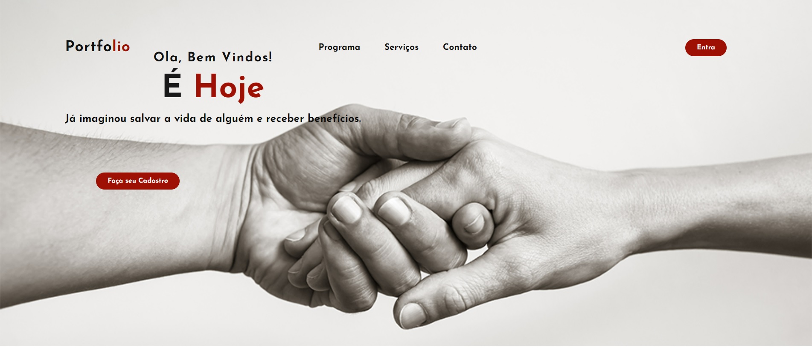

# Projeto É Hoje!

Este projeto é uma landing page do projeto É Hoje.

# Índice

* [Descrição do Projeto](#descrição-do-projeto)
* [Status do Projeto](#status-do-projeto)
* [Funcionalidades e Demonstração da Aplicação](#funcionalidades-e-demonstração-da-aplicação)
* [Acesso ao Projeto](#acesso-ao-projeto)
* [Tecnologias Utilizadas](#tecnologias-utilizadas)
* [Pessoas Desenvolvedoras do Projeto](#pessoas-desenvolvedoras-do-projeto)

## Descrição do Projeto

### Como surgiu o Meu Projeto:

Nosso projeto teve origem a partir de pesquisas realizadas sobre os bancos de sangue na cidade de Recife, no estado de Pernambuco. Identificamos a escassez de suprimentos sanguíneos devido à falta de doações. Essa é uma questão que pode ser facilmente resolvida, desde que sejam implementados métodos que despertem o interesse dos doadores, mantendo em mente o objetivo mais importante: salvar vidas.
 
## Status do Projeto 

``Em construção``

## Funcionalidades e Demonstração da Aplicação

- `Funcionalidade 1`:  Acesso do doador ao projeto.
- `Funcionalidade 2`:  Acesso para empresas se associarem.
- `Funcionalidade 3`: Tecnologias utilizadas no projeto

## Acesso ao Projeto

### Acesso do doador interessado:
 

Os doadores poderão acessar a plataforma "É Hoje" para facilitar o processo. Ao visitar o site, os doadores poderão se cadastrar para aproveitar os benefícios do programa, além de receber orientações sobre como realizar a doação e informações sobre os locais disponíveis para a doação.

###  Acesso para empresas parceiras:

As empresas interessadas em apoiar o projeto podem se registrar na plataforma e se tornar parceiras do programa "É Hoje". Além de desempenhar um papel significativo na sociedade, essas empresas podem desfrutar de benefícios, como a redução de seus tributos.

## Tecnologias Utilizadas

- ``HTML 5``
- ``CSS 3``
- ``MongoDB``
- ``Postman``
## Pessoas Desenvolvedoras do Projeto

 
[Turma II - Full Stack Senac-PE](https://github.com/Tuanesfreitas) 

